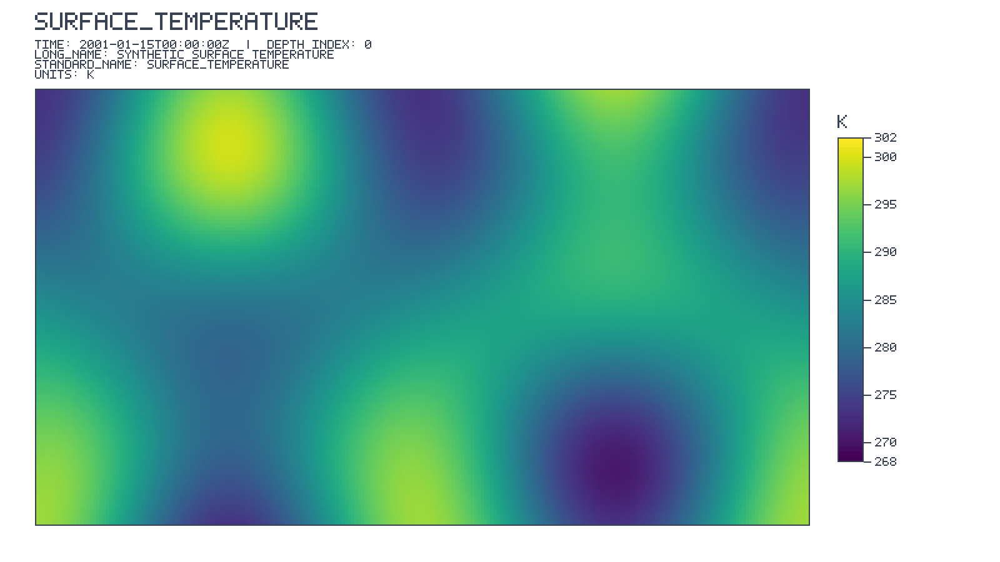
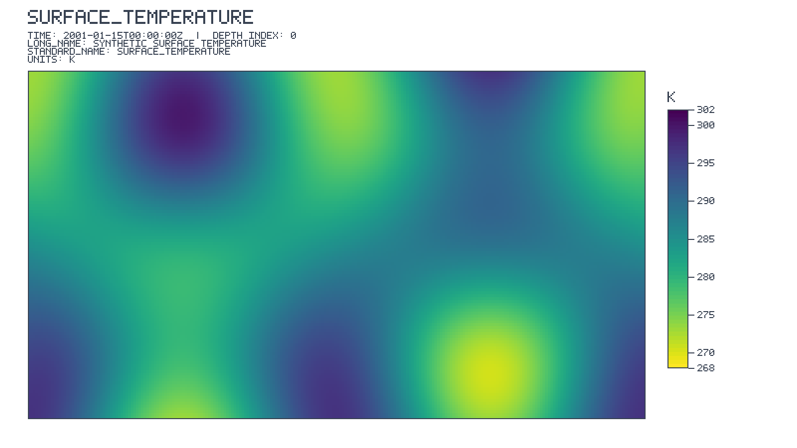

# ncview-rs

[](https://github.com/bbakernoaa/ncview-rs/actions/workflows/ci.yml)
[](LICENSE)

`ncv` is a terminal-native, read-only scientific viewer for local NetCDF-4 files stored in HDF5.
It is designed for SSH sessions on HPC systems and is distributed as a single Rust binary with no
native NetCDF/HDF5 runtime dependency.

The project focuses on fast inspection rather than data editing: slice a variable, inspect exact
values, compare time/depth frames, and export a publication-ready view without leaving the
terminal.

## Quick start

Download a platform archive from the repository's [GitHub Releases](https://github.com/bbakernoaa/ncview-rs/releases) page, unpack it, and put `ncv`
on your `PATH`:

```bash
tar -xzf ncv-linux-x86_64.tar.gz
install -m 755 ncv/ncv ~/.local/bin/ncv
ncv path/to/data.nc
```

Or build from source with Rust 1.90 or newer:

```bash
git clone https://github.com/bbakernoaa/ncview-rs.git
cd ncview-rs
cargo install --path . --locked
ncv path/to/data.nc
```

The release workflow publishes Linux x86_64, a glibc-independent static Linux x86_64 (musl),
macOS arm64, and Windows x86_64 archives for tags named `v*`. Each release includes a
`SHA256SUMS` file. On older HPC distributions, use `ncv-linux-x86_64-musl.tar.gz`.

## Screenshots

These examples are generated from a deterministic synthetic field, so the repository never embeds
private scientific data. The same export path is used for real NetCDF-4 slices.

<table>
  <tr>
    <td></td>
    <td></td>
  </tr>
  <tr>
    <td align="center">Presentation-ready PNG export</td>
    <td align="center">The same slice with the colormap reversed</td>
  </tr>
</table>

The editable vector companions are available as
[Viridis SVG](assets/readme/ncv-export-viridis.svg) and
[reversed-colormap SVG](assets/readme/ncv-export-reversed.svg).

## Usage

```bash
cargo run --release -- path/to/data.nc
# or, after installation:
ncv path/to/data.nc
# multiple files (shell globs are expanded by your shell):
ncv files_to_open_*.nc
```

The dashboard provides variable and dimension navigation, `c` palette cycling, `v` palette
reversal, `a` automatic limits, `l` limits, `f` data masking, `s` linear/log color scaling,
`z` current/global color scaling, `r` zoom reset, `x` axis selection, `b` filled map backdrop,
`<`/`>` date stepping, and `-`/`+` playback speed, Space play/pause, Enter
time-series inspection, and `g` logical/projected grid selection. The sidebar includes clickable
date step, playback speed, scale-scope, palette, limits, mask, axis, and zoom controls. For a
variable with a vertical (depth/level) axis, a full-width **Level** bar sits above the time bar
showing the current layer (`index/N` plus the CF label, or the dimension name when the file has
none); click or drag it to seek, scroll over it to step, and use `[`/`]` from anywhere. The
sidebar also shows a **Level** section with the layer list, `◂ Prev`/`Next ▸` steppers, and a
scrollable list; `Tab` focuses the level list so `↑`/`↓` move a cursor and `Enter` applies it
(`Tab`/`Esc` leave focus). Press
`Ctrl-P` or `:` for a searchable command palette; `?` opens the keyboard/mouse help. In the limits dialog, type directly to replace the selected
minimum or maximum, use Tab to switch fields, and press Enter to apply (Esc cancels). `q` exits
and restores the terminal. When multiple files are open, `{` and `}` switch the active dataset.

The sidebar also exposes clickable buttons for palette cycling, automatic limits, limits editing,
filtering, axis selection, and zoom reset. Drag across the map to zoom to a region; use
Shift+arrow keys or drag a zoomed map to pan; use Shift-drag to zoom again inside the current view, and `r` to return to the full map. Press `b` to layer a D3-inspired
ocean, graticule, and filled Natural Earth land backdrop beneath the scientific raster; valid
data is composited above it and fill/missing cells reveal the geographic context. The timeline
has a visible Play/Pause button, a progress gauge, and labeled speed controls.

Move the mouse over the map to see its latitude, longitude, and current-slice value in the status
bar. Click a map cell to pin it (shown with a marker), then press Enter to load its full time
series. The status bar also reports min/max/mean and finite-count statistics for the displayed
slice. Coordinate variables are read from NetCDF metadata, including 2-D curvilinear latitude
and longitude fields; when a file has no coordinate variable, the status falls back to source
indices.
NetCDF-4 subgroup variables are shown with qualified names such as `physics/temperature` and can
be sliced directly; grouped coordinate fields currently fall back to source indices while
retaining the group variable's data and metadata.

The data mask keeps only values between the chosen bounds; NetCDF `_FillValue` and missing values
remain masked automatically by the data loader.

By default, automatic colors follow the currently displayed slice, so zooming improves contrast.
Press `z` or click the scale-scope button to switch to `global`, which preserves the full unzoomed
slice range while zooming. Manual limits always take precedence over either automatic mode.

The coastline overlay is backed by vendored 110m, 50m, and 10m Natural Earth land topologies from
[world-atlas](https://github.com/topojson/world-atlas) (distributed through jsDelivr). It is a
presentation aid only; it never changes data values or replaces a dataset-provided land/sea mask.
The overlay is disabled at startup so the first map render does not load or index any polygons;
press `b` (or use the command palette) to enable it. Once enabled, the fast 110m overlay is used
by default. Set `NCVIEW_LAND_DETAIL=auto` to select 50m for regional views and 10m for local zooms,
or force a level with `NCVIEW_LAND_DETAIL=50m`/`10m`. The 110m geometry is decoded at build time;
the larger regional assets are parsed once on first use and cached for the session.

### Scientific colour maps

The single-binary catalog includes Viridis, Plasma, Turbo, Inferno, Magma, Cividis, Cool, Warm,
Cubehelix, and Spectral. `ncv` can also load additional `.ncmap` files from the
[ncview-scientific-colour-maps](https://github.com/samhatfield/ncview-scientific-colour-maps)
distribution (the maps originate from Fabio Crameri's scientific colour-map collection). Place
the files in the working directory, or point `NCVIEW_COLORMAPS` at a directory containing them.
`NCVIEW_LIB_DIR` and `NCVIEWBASE` are also searched, including their conventional
`share/ncview/colormaps` locations. Press `c` to cycle through every valid map discovered at
startup; malformed files are ignored.

The interface uses a Catppuccin-inspired RGB theme, rounded ratatui panels, popup shadows, and
Nerd Font icons with Unicode fallbacks. A terminal without Nerd Font glyphs will still retain the
layout and color treatment.

NetCDF-4/HDF5 and local GRIB2 are supported. GRIB2 is decoded with the pure-Rust `grib` feature
set; `.grib`, `.grib2`, `.grb`, `.grb2`, and GRIB-magic files are detected automatically. Source
files are never modified. NetCDF-3 and arbitrary HDF5 files are rejected before terminal entry
with an actionable diagnostic.

### Remote object access

Explicit S3, GCS, and Azure Blob locations are accepted with the forms
`s3://bucket/key`, `gs://bucket/key`, `az://container/key`, and
`abfs[s]://container@account.endpoint/key`. Provider credentials are read from the ambient
provider configuration; secrets are not accepted in arguments or persisted. The terminal starts
before remote opening completes, and remote GRIB2 objects use bounded `HEAD`/range requests plus
an optional colocated `.idx` sidecar. A large unindexed GRIB2 object is refused rather than
silently downloaded in full.

Remote NetCDF-4 objects up to 64 MiB use a bounded fallback through the existing OxiH5/OxiNetCDF
byte reader. Larger objects use a bounded metadata window and source-backed HDF5 range reads for
chunk indexes, compressed chunks, masks, coordinates, and selected contiguous rows; the complete
object is never materialized. Metadata windows grow only to 64 MiB, and unsupported HDF5 layouts
or non-unit-stride contiguous hyperslabs fail explicitly with an actionable diagnostic.

GRIB2 `.idx` sidecars can also be turned into deterministic Kerchunk-compatible reference JSON:

```bash
ncv manifest --format kerchunk --input forecast.grib2 --idx forecast.grib2.idx \
  --output forecast.refs.json --strict
```

Use `--format virtualizarr` for the VirtualiZarr Kerchunk-parser profile. The manifest retains
raw table codes and the full Section 4 product payload, so aerosol fields that share a display
short name (for example `AOTK`) remain independently selectable by species, particle-size
interval, wavelength, and product-template context. The pinned NOAA/NCEP table inventory and
update policy are documented in `tools/grib2_tables/README.md`.

## Configuration

The most useful runtime settings are environment variables:

| Variable | Values | Purpose |
| --- | --- | --- |
| `NCVIEW_THREADS` / `RAYON_NUM_THREADS` | integer (e.g. `4`) | Set parallel rasterization threads (defaults conservatively to `min(CPUs, 8)` to avoid hogging HPC head node resources) |
| `NCVIEW_IMAGE_PROTOCOL` | `kitty`, `sixel`, `iterm2`, `cells` | Override graphics capability detection |
| `NCVIEW_SCIENTIFIC_RENDERING` | `1`/`0` | Keep scientific nearest-neighbor rendering enabled or allow interpolation |
| `NCVIEW_IMAGE_FILTER` | `nearest`, `lanczos3`, `catmull-rom`, `triangle`, `gaussian` | Select the unlocked image filter |
| `NCVIEW_LAND_DETAIL` | `110m`/`50m`/`10m`/`auto` | Select coastline resolution after enabling `b` |
| `NCVIEW_COLORMAPS` | directory | Add `.ncmap` files to the palette catalog |
| `NCVIEW_EXPORT_DIR` | directory | Choose where `e` writes exports |
| `NCVIEW_EXPORT_BACKGROUND` | `transparent`/`white` | Select export background |

For example, a conservative SSH launch is:

```bash
NCVIEW_IMAGE_PROTOCOL=cells ncv data.nc
```

## Terminals and SSH

Kitty, Sixel, and iTerm2 protocols are used when detected after entering the terminal session. The map is
encoded as a true-color image and nearest-neighbor-upsampled by default so zoomed scientific cells stay
crisp; set `NCVIEW_IMAGE_FILTER=lanczos3`, `catmull-rom`, `triangle`, or `gaussian` if interpolation is
preferred after setting `NCVIEW_SCIENTIFIC_RENDERING=0` (scientific/cell-preserving mode is locked by
default). Press `i` to cycle filters when unlocked. Hover values are shown in the status bar and pinned
points are rendered on the image. The header reports the active renderer (`Kitty truecolor`, `Sixel
truecolor`, `iTerm2 truecolor`, or `cell fallback`). iTerm2 itself uses the iTerm2 image
protocol rather than Kitty/Sixel. If a multiplexer blocks capability probing, set
`NCVIEW_IMAGE_PROTOCOL=kitty`, `NCVIEW_IMAGE_PROTOCOL=sixel`, or `NCVIEW_IMAGE_PROTOCOL=iterm2`
to request a protocol explicitly.
Half-block Unicode rendering remains available as the portable fallback, including over OpenSSH
and tmux.
No X11 forwarding, native NetCDF/HDF5 runtime, or Chafa installation is required.

Graphics rendering uses a viewport-bounded aggregation pass when a source slice is larger than the
terminal canvas, reducing source cells into display bins before color mapping. This keeps large and
zoomed views bounded by the terminal resolution rather than blurring a full-size source image.

Press `e` to export the current variable/time/depth slice as a presentation-ready PNG, a
self-contained SVG, and a machine-readable JSON sidecar. The PNG contains the map, colorbar, and
tick marks for direct insertion into Google Slides, PowerPoint, reports, and notebooks; the SVG
retains editable text and full metadata, while JSON preserves CF/COARDS names, units, limits, and
slice coordinates. All use a 16:9 canvas where applicable, with a transparent background by
default and dark text/borders for readability. Set `NCVIEW_EXPORT_TEXT=light` when compositing on
a dark slide background, `NCVIEW_EXPORT_BACKGROUND=white` for an opaque white canvas, and use
`NCVIEW_EXPORT_DIR` to choose the output directory.
SVG font selection can be customized with `NCVIEW_EXPORT_FONT`, for example
`NCVIEW_EXPORT_FONT="Iosevka Nerd Font, Symbols Nerd Font, sans-serif"`. PNG exports keep using
the embedded font so they remain deterministic on machines without that font installed.

Curvilinear projected mode uses nearest-coordinate lookup and discloses that the presentation is
an approximation; status values retain original source indices. See the
[feature quickstart](specs/001-terminal-data-viewer/quickstart.md) for compatibility, cleanup,
performance, and moderated-usability procedures.

## Development

Install the repository's pre-commit checks with:

```sh
pip install pre-commit
pre-commit install
```

The hooks reject raw GRIB/IDX datasets and large files, then run `cargo fmt`,
Clippy, and the full test suite before each commit. CI remains the final check.

Plotter chart labels use the embedded Fira Code font so Linux builds do
not depend on a system `fontconfig` installation. Its SIL Open Font License is
included at `assets/fonts/OFL.txt`.

Run the same checks used by GitHub Actions before opening a pull request:

```bash
cargo fmt --all -- --check
cargo clippy --locked --all-targets --all-features -- -D warnings
cargo test --locked --all-targets
cargo build --locked --release
```

The repository keeps the NetCDF/HDF5 parser patch under `vendor/` and embeds the selected
scientific colour maps and world-atlas coastline assets at build time. Large local datasets and
generated exports are ignored by Git; they should not be committed to the repository.

## Releases and Versioning

This project strictly adheres to [Semantic Versioning 2.0.0](https://semver.org/), and version
bumps are automated with [release-plz](https://release-plz.dev):

1. Merge a pull request into `main`. The Release-plz workflow reads the
   [Conventional Commit](https://www.conventionalcommits.org/) messages
   (`fix:` → patch, `feat:` → minor, `!`/`BREAKING CHANGE:` → major) and opens or updates a
   `chore: release v0.x.y` pull request that bumps `Cargo.toml` and prepends the `CHANGELOG.md`
   entry.
2. Merge that release pull request. Release-plz creates the `v0.x.y` Git tag.
3. The tag push triggers the Release workflow, which builds and publishes the binaries.

So the only manual step is merging the release PR — the version number, changelog, tag, and
binaries all follow automatically. Non-conventional commit messages are still released (as a
patch bump) and listed under an "Other" changelog section.

Cross-platform binary archives (Linux x86_64 glibc, Linux x86_64 musl/static, macOS arm64, and
Windows x86_64) and SHA256 checksums are automatically built and published via GitHub Actions
whenever a Git tag following the `v*` pattern (e.g. `v0.5.1`) is pushed to the repository. The
musl archive is intended for older HPC distributions whose glibc is too old for the regular Linux
build. The latest pre-built releases are accessible on the [GitHub Releases Page](https://github.com/bbakernoaa/ncview-rs/releases).

Each versioned release also re-points a floating `latest` Git tag and a matching "Latest release"
GitHub Release at the newest build, so installers can pin a stable URL without knowing the version
number, for example
`https://github.com/bbakernoaa/ncview-rs/releases/download/latest/ncv-linux-x86_64.tar.gz`. Prefer
the numbered tag when you need a reproducible download; use `latest` when you always want the most
recent binary.

### One-time setup for the Release-plz workflow

- Repository **Settings → Actions → General → Workflow permissions**: select
  "Read and write permissions" so release-plz can open the release PR.
- Create a fine-grained personal access token with **Contents: Read and write** on this
  repository and store it as the `RELEASE_PLZ_TOKEN` repository secret. GitHub ignores workflow
  events caused by the default `GITHUB_TOKEN`, so without a PAT the `v*` tag would be created but
  the Release workflow would not run.
- The crate is not published to crates.io; release-plz runs in git-only mode and derives the
  current version from the existing `v*` tags.

## License

`ncview-rs` is released under the [MIT License](LICENSE).
