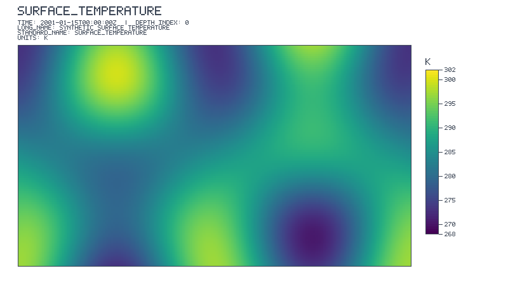
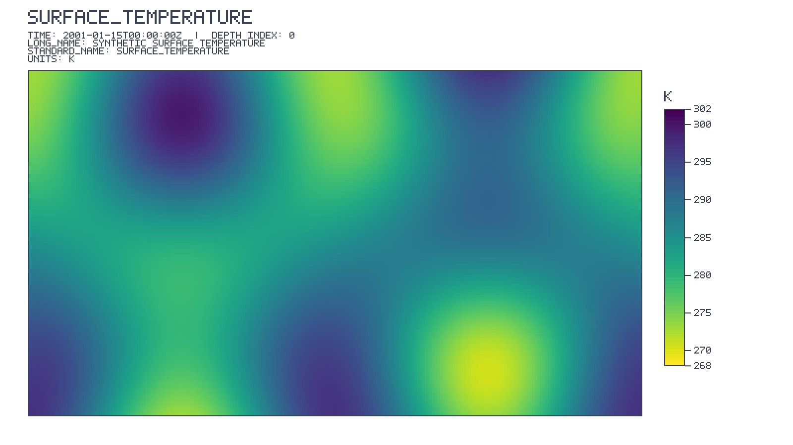

# ncview-rs

[](https://github.com/bbakernoaa/ncview-rs/actions/workflows/ci.yml)
[](LICENSE)

`ncv` is a terminal-native, read-only scientific data viewer for NetCDF-4, GRIB2, and
Kerchunk/VirtualiZarr reference manifests. It is designed for SSH sessions on HPC systems and
ships as a single Rust binary with no native NetCDF/HDF5 runtime dependency.

The focus is **fast inspection, not editing**: slice a variable, inspect exact values, compare
time/depth frames, and export a publication-ready view — all without leaving the terminal.

## Documentation

The complete user guide — quickstart, how-to guides, keyboard/CLI/environment reference, and
explanations of data fidelity, terminal protocols, and remote access — is published at
**<https://bbakernoaa.github.io/ncview-rs/>** (source in [`docs/`](docs/)).


## Quick start

Download a platform archive from the repository's [GitHub Releases](https://github.com/bbakernoaa/ncview-rs/releases) page, unpack it, and put `ncv`
on your `PATH`:

```bash
tar -xzf ncv-linux-x86_64.tar.gz
install -m 755 ncv/ncv ~/.local/bin/ncv
ncv path/to/data.nc
```

Or build from source with Rust 1.90 or newer:

```bash
git clone https://github.com/bbakernoaa/ncview-rs.git
cd ncview-rs
cargo install --path . --locked
ncv path/to/data.nc
```

The release workflow publishes Linux x86_64, a glibc-independent static Linux x86_64 (musl),
macOS arm64, and Windows x86_64 archives for tags named `v*`. Each release includes a
`SHA256SUMS` file. On older HPC distributions, use `ncv-linux-x86_64-musl.tar.gz`.

Derive new fields across files with the VERDI-style formula editor (press `=`), or headlessly:

```bash
ncv --formula "dO3 = O3[1] - O3[2]" base.nc sensitivity.nc
ncv --batch --export-dir plots --formula "avg = mean(O3)" base.nc
```

See [Derive variables with formulas](docs/how-to/derive-variables-with-formulas.md).


## Screenshots

These examples are generated from a deterministic synthetic field, so the repository never embeds
private scientific data. The same export path is used for real NetCDF-4 slices.

<table>
  <tr>
    <td></td>
    <td></td>
  </tr>
  <tr>
    <td align="center">Presentation-ready PNG export</td>
    <td align="center">The same slice with the colormap reversed</td>
  </tr>
</table>

The editable vector companions are available as
[Viridis SVG](assets/readme/ncv-export-viridis.svg) and
[reversed-colormap SVG](assets/readme/ncv-export-reversed.svg).

## Development

Install the repository's pre-commit checks with:

```sh
pip install pre-commit
pre-commit install
```

The hooks reject raw GRIB/IDX datasets and large files, then run `cargo fmt`,
Clippy, and the full test suite before each commit. CI remains the final check.

Plotter chart labels use the embedded Fira Code font so Linux builds do
not depend on a system `fontconfig` installation. Its SIL Open Font License is
included at `assets/fonts/OFL.txt`.

Run the same checks used by GitHub Actions before opening a pull request:

```bash
cargo fmt --all -- --check
cargo clippy --locked --all-targets --all-features -- -D warnings
cargo test --locked --all-targets
cargo build --locked --release
```

The repository keeps the NetCDF/HDF5 parser patch under `vendor/` and embeds the selected
scientific colour maps and world-atlas coastline assets at build time. Large local datasets and
generated exports are ignored by Git; they should not be committed to the repository.

## Releases and Versioning

This project strictly adheres to [Semantic Versioning 2.0.0](https://semver.org/), and version
bumps are automated with [release-plz](https://release-plz.dev):

1. Merge a pull request into `main`. The Release-plz workflow reads the
   [Conventional Commit](https://www.conventionalcommits.org/) messages
   (`fix:` → patch, `feat:` → minor, `!`/`BREAKING CHANGE:` → major) and opens or updates a
   `chore: release v0.x.y` pull request that bumps `Cargo.toml` and prepends the `CHANGELOG.md`
   entry.
2. Merge that release pull request. Release-plz creates the `v0.x.y` Git tag.
3. The tag push triggers the Release workflow, which builds and publishes the binaries.

So the only manual step is merging the release PR — the version number, changelog, tag, and
binaries all follow automatically. Non-conventional commit messages are still released (as a
patch bump) and listed under an "Other" changelog section.

Cross-platform binary archives (Linux x86_64 glibc, Linux x86_64 musl/static, macOS arm64, and
Windows x86_64) and SHA256 checksums are automatically built and published via GitHub Actions
whenever a Git tag following the `v*` pattern (e.g. `v0.5.1`) is pushed to the repository. The
musl archive is intended for older HPC distributions whose glibc is too old for the regular Linux
build. The latest pre-built releases are accessible on the [GitHub Releases Page](https://github.com/bbakernoaa/ncview-rs/releases).

Each versioned release also re-points a floating `latest` Git tag and a matching "Latest release"
GitHub Release at the newest build, so installers can pin a stable URL without knowing the version
number, for example
`https://github.com/bbakernoaa/ncview-rs/releases/download/latest/ncv-linux-x86_64.tar.gz`. Prefer
the numbered tag when you need a reproducible download; use `latest` when you always want the most
recent binary.

### One-time setup for the Release-plz workflow

- Repository **Settings → Actions → General → Workflow permissions**: select
  "Read and write permissions" so release-plz can open the release PR.
- Create a fine-grained personal access token with **Contents: Read and write** on this
  repository and store it as the `RELEASE_PLZ_TOKEN` repository secret. GitHub ignores workflow
  events caused by the default `GITHUB_TOKEN`, so without a PAT the `v*` tag would be created but
  the Release workflow would not run.
- The crate is not published to crates.io; release-plz runs in git-only mode and derives the
  current version from the existing `v*` tags.

## License

`ncview-rs` is released under the [MIT License](LICENSE).
