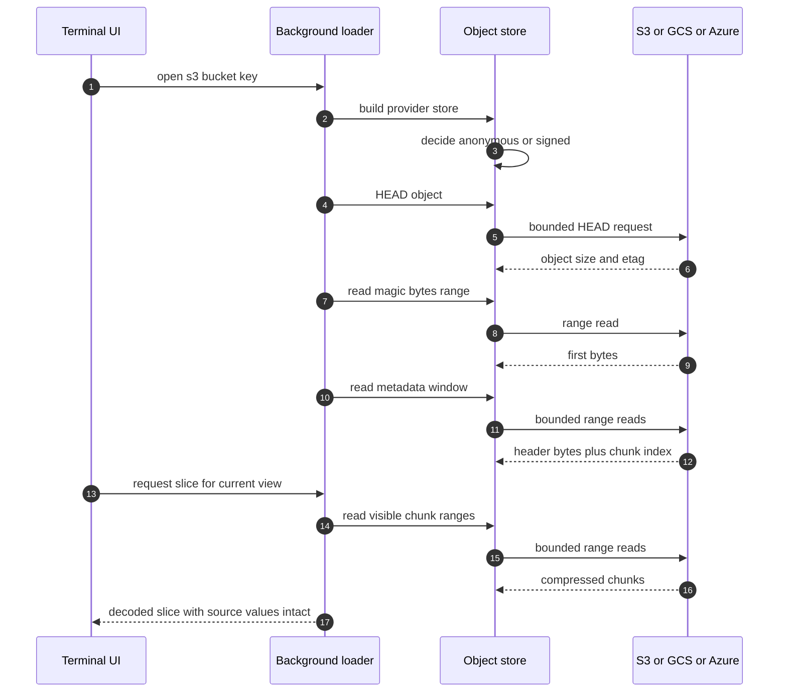

# How remote access works without downloading files

`ncv` opens S3, GCS, and Azure Blob objects by **byte-range reading** — it
fetches only the metadata and data slices you actually look at.

## Range reads, not downloads

A NetCDF-4/HDF5 file stores its structure in headers and its data in chunks
scattered through the file. `ncv` reads:

1. a bounded **metadata window** (growing only to 64 MiB) to find variable
   definitions, chunk indexes, and coordinates, then
2. targeted range requests for the **compressed chunks inside your view**.

Objects larger than 64 MiB are never materialized in full. Objects up to 64 MiB
use a simpler bounded fallback reader that loads the whole (small) object into
memory in one range read. Unsupported HDF5 layouts and non-unit-stride
contiguous hyperslabs **fail explicitly** with an actionable diagnostic
instead of showing a partial or wrong view — the same fidelity rule as local
files.

GRIB2 over the network follows the same principle with `HEAD`/range requests,
optionally guided by a colocated NOAA-style `.idx` sidecar that maps records
to byte ranges. A large unindexed GRIB2 object is refused rather than silently
downloaded in full. Reference manifests (`ncv manifest ...`) are the portable
alternative: they record the byte ranges as JSON so any Kerchunk-compatible
tool gets the same map.

## Why public buckets used to hang (and the metadata probe)

Cloud SDKs normally look for credentials in ambient configuration, then ask
the **instance metadata service** (a link-local endpoint, e.g.
`169.254.169.254`) for a role token. On a laptop that endpoint does not
exist — and without care, every object request retries the token lookup for
minutes, making public buckets appear broken.

`ncv` now probes the metadata endpoint **once per process** (a cached TCP
connect with an 800 ms budget for each candidate endpoint; custom endpoints set
through `AWS_EC2_METADATA_SERVICE_ENDPOINT`, `GCE_METADATA_HOST` or
`GCE_METADATA_IP`, `MSI_ENDPOINT`, or `IDENTITY_ENDPOINT` are probed too). When
there are no ambient credentials *and* no reachable metadata service, it uses
**anonymous, credential-free access** — the correct mode for public research
buckets such as `s3://noaa-gefs-pds`. Provider-internal retries are bounded
(three retries, ten seconds total) and each `ncv` range request adds its own
bound of three attempts with a 30-second per-request timeout and 100 ms to 2 s
exponential backoff, so a genuinely misconfigured private bucket fails fast with
a clear error.

Force the behavior with `NCVIEW_ANONYMOUS_ACCESS=1` to always use anonymous
access. Any other value, including `0`, leaves the automatic decision (ambient
credentials, then the metadata probe) in charge — it does **not** force signed
access. The probe and open happen on a background loader thread, so the
terminal UI starts before the network does any work.

## Credentials and safety

- Credentials come only from ambient provider configuration (`AWS_*`,
  `GOOGLE_*`, `AZURE_*`); secrets are never accepted in command-line arguments
  and never persisted.
- Remote sources are read-only, exactly like local ones.

## Related

- [Access remote data](../how-to/access-remote-data.md)
- [Generate a GRIB2 manifest](../how-to/generate-grib2-manifest.md)
- [Environment reference](../reference/environment.md)

